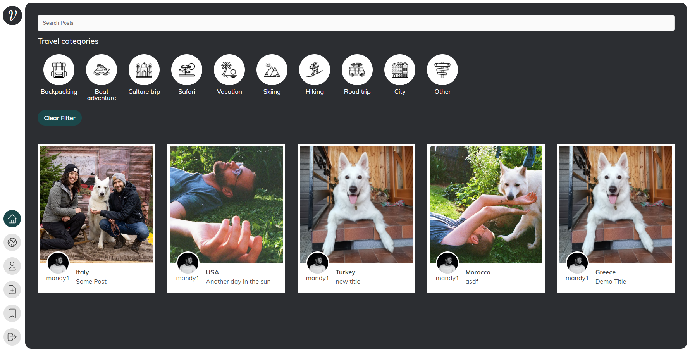

# Voyage travel

as vanilla as possible, no frameworks of utils. this is a hackathon style project, to see how far I could get with little to no time invested.

> design is not my own. was created by a colleague of a friend for their project (forked, and rewritten)

## 📦 start

run the php dev server, and serve the public directory: `php -S localhost:8080 -t ./public` (requires php cli to be installed locally)

## 🎓 issues / compromises / decisions

this is just for the sake of playing around with php.

-   `public` is served, to prevent direct access to non-page and non-endpoint resources
-   app internals are located in `app`
-   for simplicity sakes, the file database is not cached or thought about at all. using a json file was a requirement.  
    with more time i'd at least limit the amounts of serializations and file access (keep in memory)
-   endpoints are _not secured_, session is just to sketch out a basic login state
-   little to no error handling
-   most input fields are prefilled, to easy development / manual testing
-   using ESM javascript modules, to simplify javascript handling -> should be bundled and minified in prod
-   using js classes -> using classes was one of the requirements, I wanted to keep, just because I usually write everything functional
-   javascript render optimization: there's a lot of DOM writes, which would normally hurt performance. for this project i dont care
